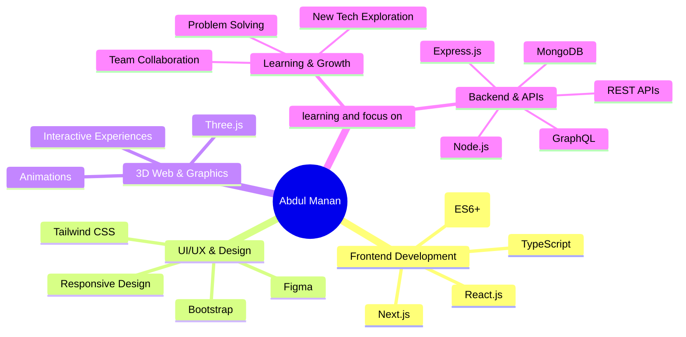

<!--

  

  -->
<!-- Intro -->
<table align="center">
  <tr>
    <td align="left"><i>Hey there, I’m Abdul Manan!</i></td>
    <td width="50"></td>
    <td align="right">
      
    </td>
  </tr>
</table>

  

  <b>
    Building clean, user-friendly websites with
    React,
    Next.js,
    GSAP,
    Tailwind CSS,
    and modern web design strategies.
  </b>
   
  <i>Abdul Manan – Creative Frontend Developer focused on responsive, animated, and elegant web experiences.</i>

###

  
  

  
  

  
  

  
  

  
  

  
  

  

   

  
  

  
  

  
  

  
  

  

  

    
    
  

###

  
  
  
  
  

###
<!-- Tech Stack & Tools -->
<!--
<h1 align="center">
  
</h1>

<table>
<tr>
<td width="50%" valign="top">

##  HTML  

- **Intro:** HyperText Markup Language → foundation of the web.  
- **Description:** Defines the structure of web pages (headings, links, etc.).  
- **Advantages:** Easy to learn, universal support, essential for all sites.  
- **Disadvantages:** Only provides structure, needs CSS & JS for design & logic.  

</td>
<td width="50%" valign="top">

##  CSS  

- **Intro:** Stylesheet language for web design.  
- **Description:** Controls layout, colors, fonts, and responsiveness.  
- **Advantages:** Powerful styling, responsive design, separates design from content.  
- **Disadvantages:** Browser inconsistencies, complex for large projects.  

</td>
</tr>
<tr>
<td width="50%" valign="top">

##  JavaScript  

- **Intro:** The language of the web.  
- **Description:** Adds interactivity (animations, forms, dynamic content).  
- **Advantages:** Runs in browsers, versatile, huge ecosystem.  
- **Disadvantages:** Can be messy if unstructured, performance issues if misused.  

</td>
<td width="50%" valign="top">

##  Three.js  

- **Intro:** A 3D JavaScript library.  
- **Description:** Builds 3D scenes, animations, and graphics in browsers.  
- **Advantages:** Simplifies WebGL, great for 3D visuals, interactive.  
- **Disadvantages:** Heavy performance load, requires optimization & learning.  

</td>
</tr>
<tr>
<td width="50%" valign="top">

##  TypeScript  

- **Intro:** A superset of JavaScript.  
- **Description:** Adds static typing for safer and scalable code.  
- **Advantages:** Fewer bugs, strong tooling, large-scale project support.  
- **Disadvantages:** Extra setup, harder for beginners, needs compilation.  

</td>
<td width="50%" valign="top">

##  Tailwind CSS  

- **Intro:** Utility-first CSS framework.  
- **Description:** Styling with ready-to-use classes directly in markup.  
- **Advantages:** Fast development, responsive, highly customizable.  
- **Disadvantages:** Cluttered HTML, memorizing class names takes time.  

</td>
</tr>
<tr>
<td width="50%" valign="top">

##  Bootstrap  

- **Intro:** Popular CSS framework.  
- **Description:** Offers pre-built components like navbars, buttons & grids.  
- **Advantages:** Quick to use, responsive, huge community.  
- **Disadvantages:** Generic design look, customization can be tricky.  

</td>
<td width="50%" valign="top">

##  MongoDB  

- **Intro:** A NoSQL document database.  
- **Description:** Stores data as JSON-like documents.  
- **Advantages:** Flexible schema, scalable, cloud-native.  
- **Disadvantages:** Weak for complex queries, data consistency challenges.  

</td>
</tr>
<tr>
<td width="50%" valign="top">

##  GraphQL  

- **Intro:** A modern query language for APIs.  
- **Description:** Clients request exactly the data they need.  
- **Advantages:** Efficient, avoids over-fetching, flexible.  
- **Disadvantages:** Complex setup, caching issues.  

</td>
<td width="50%" valign="top">

##  Next.js  

- **Intro:** A React framework by Vercel.  
- **Description:** Supports SSR, static sites, APIs, and routing.  
- **Advantages:** SEO-friendly, optimized performance, full-stack features.  
- **Disadvantages:** Opinionated, more complex than plain React.  

</td>
</tr>
<tr>
<td width="50%" valign="top">

##  React.js  

- **Intro:** JavaScript UI library.  
- **Description:** Builds reusable, component-based UIs.  
- **Advantages:** Fast, scalable, Virtual DOM, huge ecosystem.  
- **Disadvantages:** JSX learning curve, frequent updates, extra libs needed.  

</td>
<td width="50%" valign="top">

##  Figma  

- **Intro:** Collaborative design tool.  
- **Description:** Used for UI/UX design and prototyping.  
- **Advantages:** Real-time teamwork, cross-platform, easy sharing.  
- **Disadvantages:** Limited offline use, some features are paid.  

</td>
</tr>
</table>

-->
<!--

  
   

-->
<!-- Socials -->
<!--
<h1 align="center">
  
</h1>

  
  
  
  
  
  
  

  
  
  
  
  
  
  
  
  
  

-->
<!-- Professional Focus Areas -->
<h1 align="center">
  
</h1>

<!-- GitHub Stats -->
<h1 align="center">
  
</h1>
<table width="100%">
  <tr>
    <td width="33.3%" valign="top">
      
    </td>
    <td width="33.3%" valign="top">
      
    </td>
    <td width="33.3%" valign="top">
      
    </td>
  </tr>
</table>

<!--Contribution Activity -->
<!--
<h1 align="center">
  
</h1>

-->

<!-- Help by Donating -->
<h1 align="center">
  
</h1>
</h1>

  
  
  
  

  

